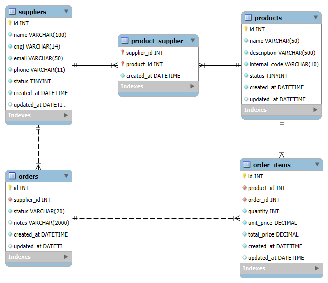

# Decisões Tomadas

## Modelagem do Banco de Dados

O banco de dados é composto por cinco tabelas, descritas abaixo:
- `suppliers`: dedicada a armazenar informações de fornecedores, contém nome, cnpj, email, telefone, status, datas de criação e atualização dos registros;
- `products`: dedicada a armazenar informações de produtos, contém nome, descrição, código interno, status, datas de criação e atualização dos registros;
- `product_supplier`: responsável por estabelecer o relacionamentos muitos para muitos entre fornecedor e produto, vinculando um fornecedor com vários produtos, assim como um produto com vários fornecedores;
- `orders`: dedicada a armazenar informações de pedidos, contém id do fornecedor, status, observações, datas de criação e atualização dos registros;
- `order_items`: dedicada a armazenar informações dos itens dos pedidos, contém id do produto, id do pedido, quantidade, preço unitário, preço total, datas de criação e atualização dos registros.

## Decisões de Arquitetura

## Uso de Filas e Jobs

## Melhorias
- Autenticação
- Envio de notificações para o e-mail do fornecedor